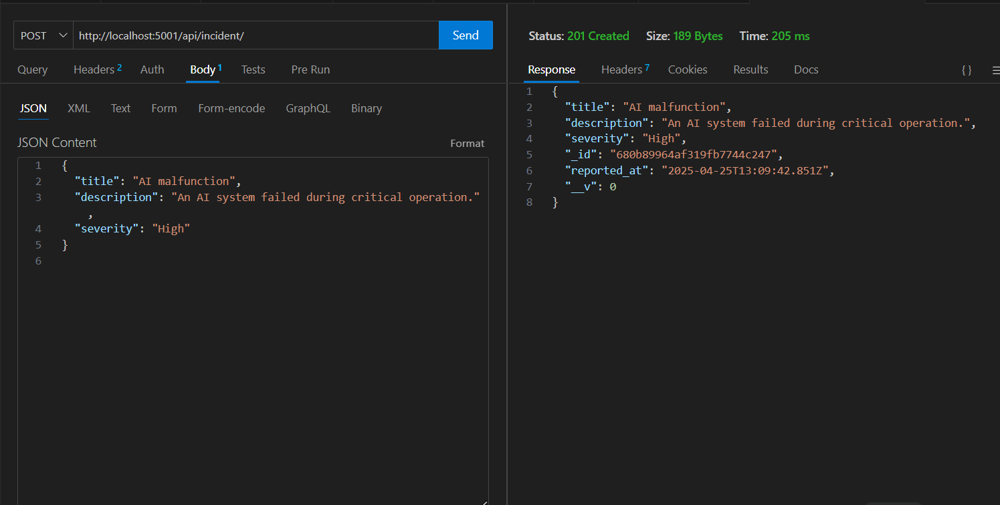
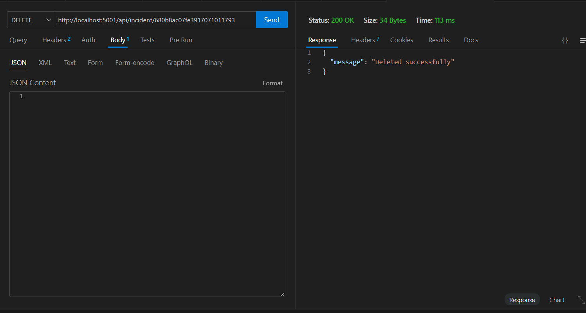

# AI Safety Incident Log API

## **Overview**
This is a RESTful API service for logging and managing AI safety incidents. The service allows users to create, retrieve, and delete AI safety incidents with a focus on simplicity and clarity. Built using the MERN stack, it is designed to showcase fundamental backend development skills, including request handling, data persistence, and adherence to REST principles.

---

## **Technologies Used**
- **Backend**: Node.js with Express.js
- **Database**: MongoDB
- **ODM**: Mongoose
- **Environment Variables**: `dotenv`

---

## **Features**
1. **Log AI Safety Incidents**: Add new incidents to the database with validation for required fields.
2. **Retrieve All Incidents**: Fetch all incidents stored in the database.
3. **Retrieve a Specific Incident**: Fetch a single incident by its ID.
4. **Delete an Incident**: Remove an incident by its ID.
5. **Error Handling**: Graceful responses for invalid input or non-existent resources.

---

## **Endpoints**
### **1. GET `/api/incident`**
Retrieve all incidents in the database.

- **Response**:
  ```json
  [
    {
      "id": "1",
      "title": "Example Title",
      "description": "Example Description",
      "severity": "Medium",
      "reported_at": "2025-04-25T18:00:00Z"
    }
  ]
  ```


### **2. POST `/api/incident`**
Log a new incident.

- **Request Body**:
  ```json
  {
    "title": "Incident Title",
    "description": "Incident Description",
    "severity": "High"
  }
  ```

- **Response**:
  ```json
  {
    "id": "2",
    "title": "Incident Title",
    "description": "Incident Description",
    "severity": "High",
    "reported_at": "2025-04-25T18:00:00Z"
  }
  ```



### **3. GET `/api/incident/:id`**
Retrieve a specific incident by ID.

- **Response**:
  ```json
  {
    "id": "1",
    "title": "Incident Title",
    "description": "Incident Description",
    "severity": "Medium",
    "reported_at": "2025-04-25T18:00:00Z"
  }
  ```

### **4. DELETE `/api/incident/:id`**
Delete a specific incident by ID.

- **Response**:
  - **Success**: 204 No Content
  - **Failure**: 404 Not Found



---

## **Setup Instructions**

### **1. Prerequisites**
- Node.js installed on your system.
- MongoDB database (local or cloud-hosted).
- Thunder Client or Postman for testing (optional).

### **2. Installation**
1. Clone the repository:
   ```bash
   git clone <repository-url>
   cd <project-folder>
   ```
2. Install dependencies:
   ```bash
   npm install
   ```

3. Create a `.env` file in the root directory and add the following:
   ```env
   PORT=5001
   MONGO_URI=<your-mongodb-uri>
   ```

4. Start the server:
   ```bash
   nodemon
   ```

5. The server will start at [http://localhost:5001](http://localhost:5001).

---

## **Database Setup**
Use MongoDB to manage the incident logs. Prepopulate the database with 2-3 sample incidents:
- Add the following code snippet to a `seeder.js` file, then run it:
  ```javascript
  const mongoose = require('mongoose');
  const Incident = require('./models/incidentModel');
  const dotenv = require('dotenv');

  dotenv.config();

  mongoose.connect(process.env.MONGO_URI, { useNewUrlParser: true, useUnifiedTopology: true })
    .then(() => {
      console.log('MongoDB connected');
      return Incident.insertMany([
        {
          title: 'Sample Incident 1',
          description: 'An AI system exhibited unexpected behavior.',
          severity: 'Medium',
          reported_at: new Date()
        },
        {
          title: 'Sample Incident 2',
          description: 'A data bias issue was identified.',
          severity: 'High',
          reported_at: new Date()
        }
      ]);
    })
    .then(() => {
      console.log('Sample data added');
      process.exit();
    })
    .catch(err => console.error(err));
  ```

---

## **Testing**
Use Thunder Client or Postman to test API endpoints. Refer to the **Endpoints** section for details on each endpoint.

---

## **Design Decisions**
1. **Validation**: Ensures all required fields are present in POST requests.
2. **Error Responses**: Clearly communicates issues like invalid inputs or non-existent resources.
3. **Scalability**: Mongoose simplifies schema management and database interactions.